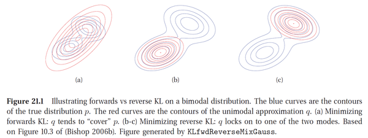

## A

* auxillary information

  辅助信息

## B

* Back propagation

  Please use the keyword deriviate to get more info for specific derivatives of each nonlinear activation function and softmax function.

* batch normalization
  把一个batch的x都变成$\frac{x-\mu}{\sigma}$ 

  ​

* Bayesian parameter estimation 贝叶斯参数估计 (BPE)
  $$
  p(\theta|X)=\frac{p(X|\theta)p(\theta)}{\int{p(X|\theta)p(\theta)}~d\theta}
  $$
  ​

## C

* convolution related concepts

  参见[演示](https://github.com/vdumoulin/conv_arithmetic)

  * padding

    在图片周围添0，分arbitrary padding, half padding, full padding

  * strides
    步幅不是1，而是2啊，3啊

* cross entropy 交叉熵

  用分布 $p$ 的最优代码来沟通分布 $q$ 发生的事件，所需的平均信息长度
  $$
  H_p(q) =\sum_xq(x)\log_2(\frac{1}{p(x)})
  $$
  ​

## D

* deconvolution

  本义是conv的逆运算，但实际是transposed convolution的误用，参见此词条

  ​

* distributed representation

  词向量

  ​

## E

* encoder decoder structure

  Language A => RNN encoder => hidden state S => RNN decoder => Language B

  ​

* entropy 熵

  沟通一个特定分布 $p$ 传递信息所需的最佳平均信息长度
  $$
  H(p)=\sum_xp(x)\log_2\frac{1}{p(x)}
  $$
  ​

* estimation of probability distribution (density)

  分成参数估计和非参数估计

  参数估计是预先假设每一个类别的概率密度函数的形式已知，而具体的参数未知，常见有最大似然估计maximum likelihood estimation(MLE) 和贝叶斯估计

  非参数估计

  ​

* exponential moving average

  有一个momentum $m$

  $\text {mean}_{t+1}=(1-m) \times \text {mean}_{t} + m \times \text {batch_mean}_{t+1}$

## F

* f-divergence

  * *f*-divergence of $q$ from $p$ is defined as定义如下

    *f* 代表的是function $f(t)$

  $$
  D_f(p \| q)=\int_x f(\frac{dp}{dq})dq
  $$

  ​	KL divergence的corresponding $f(t)$ 是 $t\ln t$ 

  * 好的性质：Non-negativity
  * 坏的性质：当 f-divergence 是离散的（如在 JS 和 KL 中），我们可能在具有梯度的学习模型中遇到问题，因为散度损失并不是在每一处都是可微分的。

## G

* GAN
  * GAN 本质上是一种试图通过生成对抗数据，通过最小化 f-divergence（概率分布的差异）来学习真实数据分布的模型。
  * loss function: 最初提出的 GAN 的最小最大目标的收敛可以解释为最小化 Jensen Shannon（JS）散度（divergence）。

## H

## I

## J

* JS散度 Jensen–Shannon divergence (JSD)
  $$
  D_{JS}(p \| q) = \frac{1}{2}D_{KL}(p\| m) + \frac{1}{2}D_{KL}(q\| m)\\
  \text{in which }m=\frac{1}{2}(p+q)\\
  D_{JS}(p \| q) =\frac{1}{2}\sum_xp(x)\log_2\frac{p(x)}{m(x)} + \frac{1}{2}\sum_xq(x)\log_2\frac{q(x)}{m(x)}
  $$
  ​

  ​

## K

* kernel
  * uinversal kernel/charasteristic kernel：能把空间填满的kernel

* KL divergence, Kullback–Leibler divergence, KL散度

  *  Kullback–Leibler divergence from $q$ to $p$ ，或者说 $p$ 相对于 $q$ 的KL散度 $D_q(p)$ 被定义为
    $$
    D_{KL}(p\| q)=D_q(p) = H_q(p) - H(p)\\
    =\sum_xp(x)\log_2\frac{1}{q(x)} - \sum_xp(x)\log_2\frac{1}{p(x)}\\
    =\sum_xp(x)\cdot\log_2\frac{p(x)}{q(x)}
    $$
    其中，$H(p)$ 为熵，沟通分布 $p$ 中发生的事件的最佳代码

    $H_q(p)$ 为交叉熵，分布 $p$ 中发生的事件用分布 $q$ 的最优代码来沟通

  * 注意，$D_q(p) \neq D_p(q)$ ，如下图：红色为 $q$ ，蓝色为 $p$ ，图(a)为 $D_{KL}(p\|q)$ 图(b)(c) 为 $D_{KL}(q\|p)$ 

    

  ​

* k nearest neighbor 

  k是hyperparameter

  随着k增加，参考范围变大，variance变小，bias变大

  弱点，dimensionality: 维度一多就歇菜了

  * irrelevant attributes，有很多维度的信息没有用
  * lack of similarity 维度高了之后，就很难“邻近”了
## L

* leaky ReLU

  ReLu是$\max(0,x)$ ，即x为负的时候，gradient是0

  leaky ReLU 是 x为负的时候，gradient是 $\lambda$

## M

*  maximum likelihood estimation 最大似然估计 MLE
   $$
   \hat \theta = \underset{\theta}{\text {argmax}}\prod_{i=1}^n p(X_i|\theta)
   $$
   ​

   一种对分布的参数估计方法，即模型已定，参数未知，求参数

   求解过程：

   1. 写出似然函数；
   2. 对似然函数取对数，并整理；
   3. 求导数 ；
   4. 解似然方程

   另一种是非参数估计，回避了对分布的假设。很多情况下我们没有分布以及条件分布（label）信息

   ​

*  model

   *  architecture / decision rule
   *  loss function
   *  gradient of loss
   *  update rule

   ​

## N

* nearest neighbor

  参加K nearest neighbor

  Advantages:

  * 简单
  * 错误率很低 only 2 times error-prone as the best imaginable classifier
  * 天生非线性

## O

## P

* parzen window

  一种非参数估计方法，又叫核密度估计（kernel density estimation）是在概率论中用来估计未知的密度函数的
  $$
  f(x)=\frac{1}{nh}\sum_{i=1}^nK(\frac{x-x_i}{h})
  $$
  其中，$K(\cdot)$ 是个kernel，核函数，$h$ 叫bandwidth，带宽，常用$h=\frac{1}{\sqrt n}$ ，$x$ 是mean

  ​

* perceptron

  a **linear classifier** on top of a simple **feature extractor**
  $$
  y=sign(\sum_{i=1}^nW_iF_i(X)+b)
  $$
  其中feature需要自己设计

* polynomial mapping

  construct new **feature vectors**: 
  $$
  \Phi(1,x_1,x_2)=(1,x_1,x_2,x_1^2,x_2^2,x_1x_2)
  $$

* Pooling methods

  * average + non-linearity
  * max
  * log-sum-exp $y=\frac{1}{\beta}log[\frac{1}{n}\sum_ie^{\beta x_i}]$
  * Lp $(\sum_i x_i^p)^\frac{1}{p}$
  * Sort pooling
  * variance 
## Q

## R

* ReLU

  * Function: $y=\max(x, 0)$

  * Derivative: 

  * $$
    \frac{\partial y}{\partial x} = \begin{cases} 
    						1, & \text{if $x>0$}.\\
       						    0, & \text{if $x \leq 0$}.
    					    \end{cases}
    $$

## S

* Sigmoid function

  * Function: $y=\frac{1}{1+e^{-x}}$

*   Derivative: $\frac{\partial y}{\partial x}=\frac{1}{1+e^{-x}} - (\frac{1}{1+e^{-x}})^2$

    ​

*   Softmax

    * Convert evidence to probability

    * Input: vector $X=(x_1, x_2, …, x_m)$ each $x_i$ is a evidence for a circumstance 

    * Output: vector $Y = (y_1, y_2, …, y_m)$ each $y_i$ is a probability for a circumstance

    * Function: $P(y=i|X) = y_i = \frac{e^{x_i}}{\sum_{j=1}^de^{x_j}}$ 

    * Derivative: 

    * $$
      \frac{\partial y_i}{\partial x_k} = \begin{cases}
      						     \frac{e^{x_i} \cdot \sum - e^{x_i} }{\sum^2} =y_i \cdot (1-y_i),~~~~ i=k \\
      						    \frac{- e^{x_i} \cdot e^{x_k} }{\sum^2}=-y_i \cdot y_k, ~~~~i\neq k \\ 
      					                 
      						 \end{cases}
      $$

    * ​

*   Stochastic Gradient Descent (SGD)

          weight = weight - learning_rate * gradient

## T

* Tanh

  * Function: 
    $$
    y=\frac{e^{2x}-1}{e^{2x}+1} ~~\text{or}\\
    y=\frac{e^{x}-e^{-x}}{e^{x}+e^{-x}}~~\text{or}\\
    y=\frac{2}{1+e^{-2x}}-1 ~~\text{or}\\
    y=\frac{\sinh(x)}{\cosh(x)} =\tanh(x)
    $$

  * Derivative: 

  * $$
    \frac{\partial y}{\partial x}=\frac{\cosh^2(x) - \sinh^2(x)}{\cosh^2(x)}\\
    =1-\frac{\sinh^2(x)}{\cosh^2(x)}\\
    =1-\tanh^2(x)
    $$

    ​

* training a model

  A typical training procedure for a neural network is as follows:

  * define the neural network that has some learnable parameters (or weights)

  * iterate over a dataset of inputs:

    * process input through network
    * compute the loss (how far is the output from being correct)

    * propagate gradients back into the network's parameters

    * update the weights of the network

      * typically using a simple update rule: weight = weight + learning_rate * gradient

        ​

* transposed convolution

  又名backward convolution, fractally strided convolution, upsampling convolution.

  

  ​

## U

## V

## W

* Wasserstein distance

  * 定义：最简单情形，分布 $p$ 和 $q$ 的Wasserstein距离定义为：边缘分布为 $p$ 和 $q$ 的联合分布 $P_{XY}$ ，期望 $E_{P_{XY}}[\|x-y\|_2^2]$ 的最小值的平方根。
    $$
    W_2(p, q)=\sqrt{\min_{P_{XY}}E_{P_{XY}}[\|x-y\|_2^2]}~~\text {s.t.}~~P_X\sim p, P_Y \sim q
    $$
    衡量了把数据从分布 $p$ 移动到分布 $q$ 时需要的平均距离最小值（可以类比为一堆	土从一个形状移动到另一个形状所需做功的最小值，也可以类比为，一堆木材，有许多供给地，很多需求地，如何用最少的成本从供给地移动到需求地）

  *  优点：

    * 连续
    * 几乎无处不在的可微分

## X

## Y

## Z

